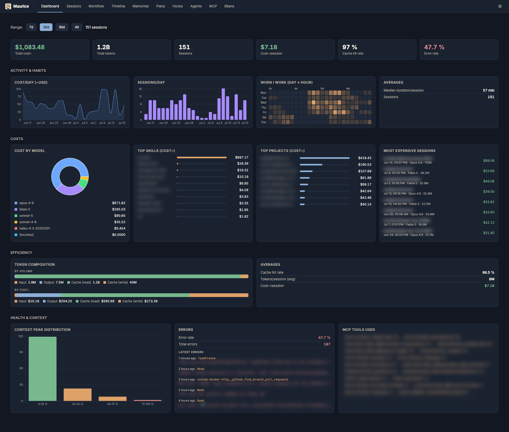
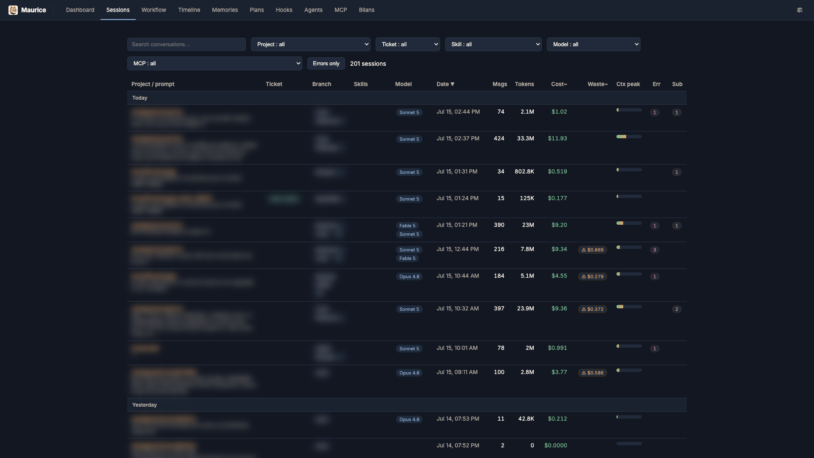
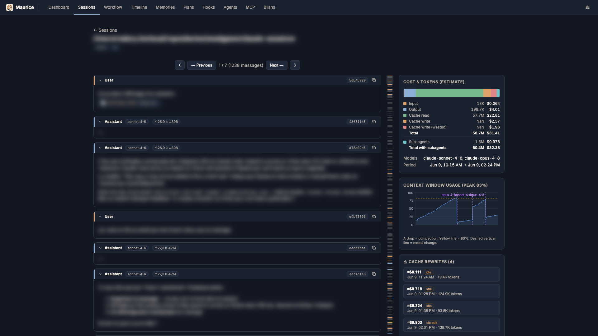
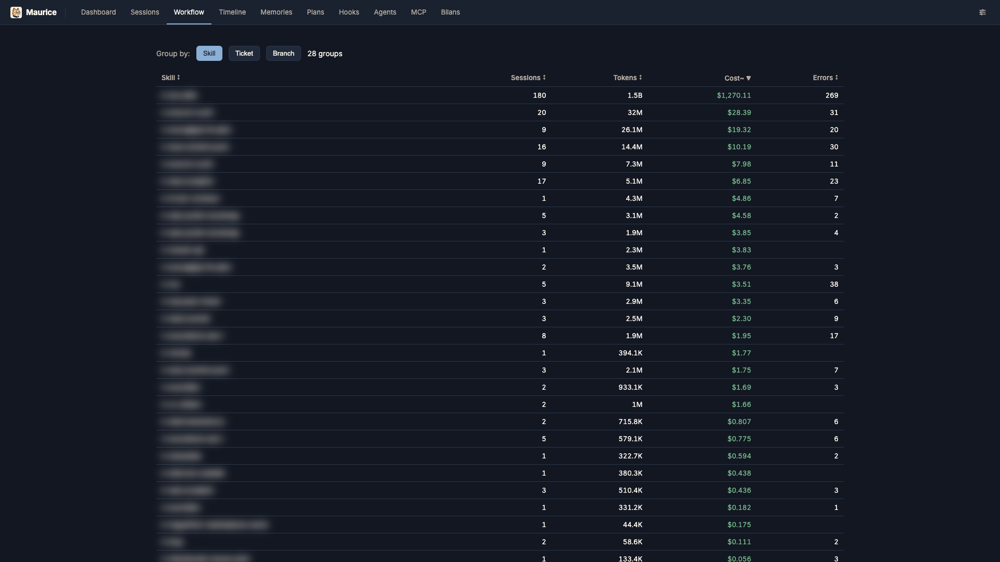
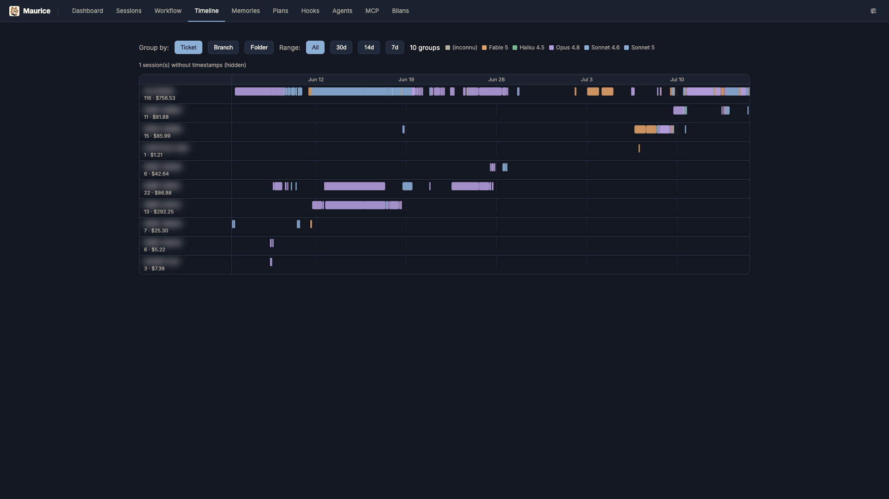
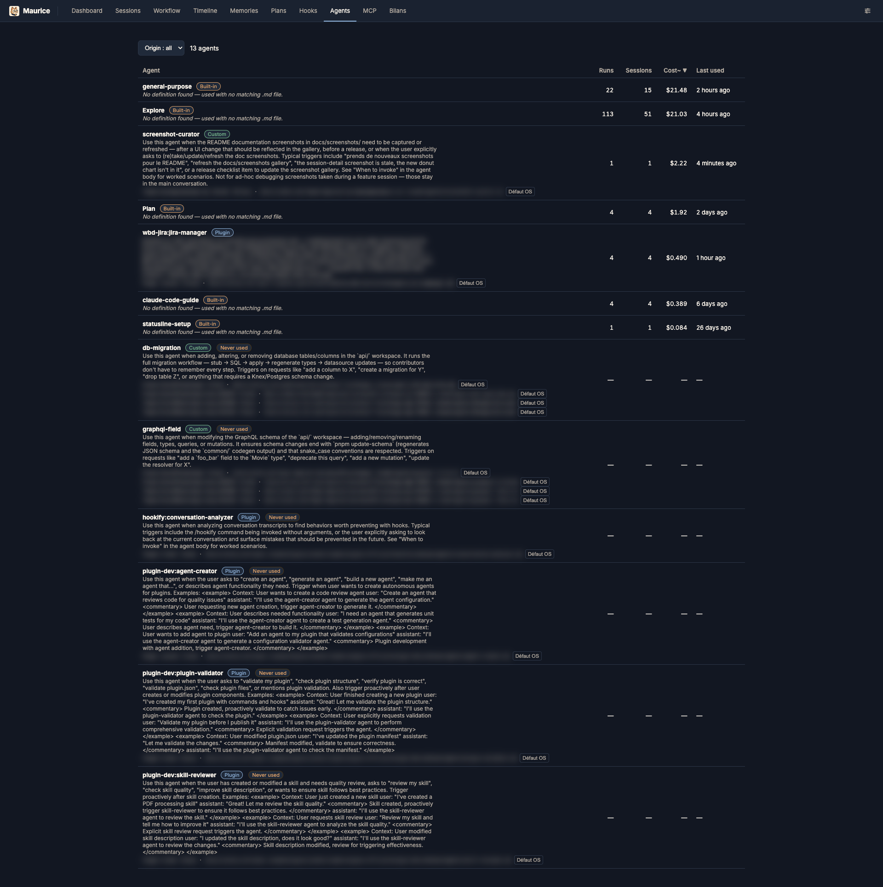

<p align="center">
  
</p>

# Maurice

A **local, read-only** web explorer for your `~/.claude` folder — built around your personal workflow (sessions by **skill**, **ticket**, **branch**), with estimated cost and context window usage.

Complements `ccusage` (CLI costs) and `awa:skill-stats`: here you **explore and re-read** conversations, not just crunch stats.

## Screenshots

> The data below is real; only confidential bits (conversation content, project names, tickets, branches) are blurred. Theme: _Maurice Nuit_.

**Dashboard** — analytics over a period: KPIs, activity charts, cost by model / skill / project.



**Sessions** — searchable, filterable list with estimated cost, peak context fill, errors and subagents.



**Session detail** — readable thread with the context-window fill curve and a cost / token panel.



|  |  |
| --- | --- |
| **Workflow** — cost pivoted by skill / ticket / branch.<br> | **Timeline** — sessions as time-positioned bars, colored by model.<br> |

**Agents** — registry of every subagent type seen in your history, joined with its on-disk definition (builtin / custom / plugin) and usage stats.



## Getting started

```bash
npm install
npm run dev      # Vite :5173 (UI) + Express API :5174, with proxy
# → http://localhost:5173
```

Production build:

```bash
npm run build
npm start        # serves dist/ + API on http://localhost:5174
```

## What it shows

- **Dashboard** — analytics overview over a period (7 / 30 / 90 days / all): KPIs (cost, tokens, sessions, cost per session, cache-hit %, error rate), activity charts (cost & sessions over time, day×hour heatmap), cost breakdown by model / skill / project, most expensive sessions, token composition, context-peak distribution, and MCP tool usage. Cards link through to filtered Sessions.
- **Sessions** — all sessions: project, ticket, skills, date, messages, tokens, **estimated cost**, **peak context window fill**, error badge, subagent count. Full-text search + filters (project / ticket / skill / model / MCP / errors). Includes a **branch column** and an **active session indicator** in the topbar.
- **Detail** — readable thread (errors highlighted, thoughts collapsible), context window fill curve (drop = compaction, dashed markers on **model switches**, per-model window %), cost/token panel with a **cost breakdown table** merging tokens and estimated cost per component (input / output / cache read / cache write / subagents) with a stacked bar strip, **MCP** tools called, **subagents** (clickable transcripts, own cost surfaced, unified with the session view), and a "copy `claude --resume <id>`" button. First/last page navigation buttons (⟪ / ⟫). Renders **inline images** embedded in the thread — both uploaded images and those returned by MCP tool results. Navigate into/out of **rewind-abandoned thread forks**, with a deep link back to the divergence point. A quick-nav panel jumps straight to any **prompt-cache rewrite** warning in the thread.
- **Cache rewrite warnings** — the provider's prompt cache expires after ~5min idle, so returning to a session after a break re-writes the whole context at the cache-write rate instead of reading it. Maurice detects this per billed request (idle vs. context-edit cause), flags it inline on the message, and aggregates it per session (count + estimated wasted cost) as a sortable column in Sessions.
- **Workflow** — sessions pivoted by **skill** (default), ticket, or branch, with per-group aggregates. Tokens/cost in the skill pivot are attributed **per message** (`attributionSkill`), so no double-counting across skills.
- **Timeline** — Gantt-style view of sessions as time-positioned bars, grouped into lanes by **ticket** (default), branch, or project, colored by model, with a period filter.
- **Memory** — browse and **delete** entries from `~/.claude/projects/*/memory/`.
- **Plans** — browse, **rename** and **delete** plan-mode markdown files from `~/.claude/plans/` (global) and each project's `.claude/plans/`, grouped by date / folder / ticket.
- **Hooks** — browse the hook commands configured in `settings.json` (global / project, plus their `.local` variants), grouped by event and filterable by scope.
- **Agents** — registry of every subagent type seen in your history, joined with its on-disk definition (builtin / custom / plugin) and usage across sessions.
- **MCP** — install instructions for the MCP server (see below) and the live list of its tools — parameters, types, descriptions — sourced from the server itself so it never drifts.
- **Bilans** — periodic summaries generated by the `awa:bilan` skill, listing completed work and key decisions per period.

## MCP server

Maurice also exposes its read-only data as an **MCP server**, so an agent can query your Claude Code history directly. It is served by the same Express process on `/mcp` (streamable HTTP), loopback-only with DNS-rebinding protection — start Maurice (`npm run dev` or `npm start`), then register it:

```bash
claude mcp add --transport http maurice http://localhost:5174/mcp
```

Tools (all read-only): `search_sessions`, `list_sessions`, `get_session`, `list_memories`, `list_bilans`, `read_bilan`, `cost_summary`, `filters`, `agents`. Cost stays an estimate (see below).

## Technical notes

- Reads `process.env.CLAUDE_DIR ?? ~/.claude`. **Read-only**, except the explicit user-driven file operations: deleting a memory entry, and deleting/renaming a plan. Caches stay in the project-local `.cache/`.
- Streaming parser; session index **disk-cached** (`.cache/`), invalidated by `(size, mtime)` — first run takes a few hundred ms, subsequent runs are near-instant.
- **Cost is an estimate** (`server/pricing.ts`): Claude Code subscriptions report `costUSD: 0`, so cost is derived from public API pricing per model. Adjust the table freely.

## Environment variables

| Var              | Default     | Purpose                                 |
| ---------------- | ----------- | --------------------------------------- |
| `CLAUDE_DIR`     | `~/.claude` | source directory (read-only)            |
| `PORT`           | `5174`      | API / production server port            |
| `CONTEXT_WINDOW` | `200000`    | window size for fill ratio              |
| `PERF`           | _(off)_     | set `1` for per-request API timing logs |

## License

[MIT](LICENSE) © Awalgawe.

Maurice is an unofficial, independent tool and is **not affiliated with, endorsed by, or sponsored by Anthropic**. "Claude" and "Claude Code" are trademarks of Anthropic. It only reads your local `~/.claude` data and never transmits it anywhere.
